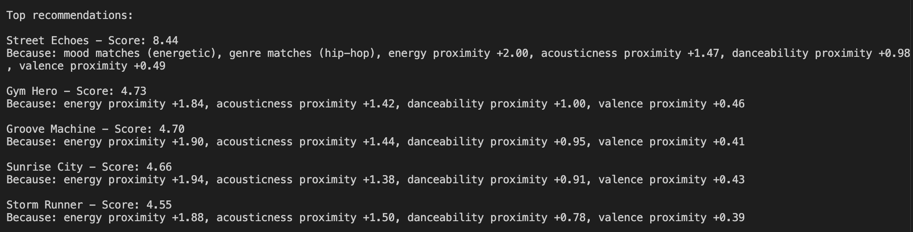
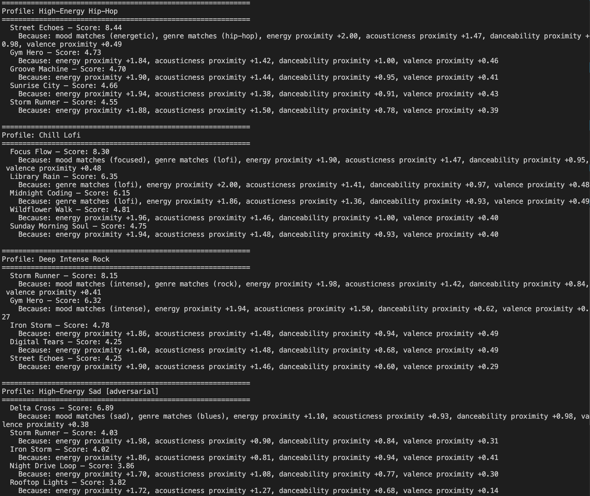

# 🎵 Music Recommender Simulation



## Project Summary

In this project you will build and explain a small music recommender system.

Your goal is to:

- Represent songs and a user "taste profile" as data
- Design a scoring rule that turns that data into recommendations
- Evaluate what your system gets right and wrong
- Reflect on how this mirrors real world AI recommenders

Replace this paragraph with your own summary of what your version does.

---

## How The System Works

### Song Features

Each song is represented by five features selected for their discriminating power and independence from one another:

- `mood` — categorical label (e.g. chill, intense, happy, focused, energetic)
- `genre` — categorical style label (e.g. hip-hop, lofi, rock, classical)
- `energy` — intensity level (0.0–1.0)
- `acousticness` — electronic vs. acoustic texture (0.0–1.0)
- `danceability` — groove and rhythmic feel (0.0–1.0)
- `valence` — emotional positivity (0.0–1.0)

`tempo_bpm` is excluded because it is highly correlated with `energy` and adds noise without new signal.

### User Profile

The user profile is a dictionary of target values — one per feature — representing the listener's ideal song. Example:

```python
user_prefs = {
    "mood":         "energetic",
    "genre":        "hip-hop",
    "energy":       0.85,
    "acousticness": 0.10,
    "danceability": 0.88,
    "valence":      0.70,
}
```

### Algorithm Recipe

#### Step 1 — Score every song

**Categorical features** award fixed points on a match:

| Feature | Match | No match |
|---|---|---|
| Mood | +2.0 pts | +0.0 pts |
| Genre | +1.5 pts | +0.0 pts |

Mood outweighs genre because users most often choose music based on how they want to feel, not strictly by style. A chill lofi track and a chill jazz track both serve a study session equally well.

**Numeric features** use a proximity formula that rewards closeness to the user's target — not simply higher or lower values:

```
points = max_points × (1 − |song_value − user_target|)
```

| Feature | Max points | Rationale |
|---|---|---|
| Energy | 2.0 | Strongest discriminator across the catalog |
| Acousticness | 1.5 | Independent texture axis (electronic vs. acoustic) |
| Danceability | 1.0 | Groove preference |
| Valence | 0.5 | Fine-tuning; partially captured by mood |

**Maximum possible score: 8.5 points**

#### Step 2 — Rank by score

All 20 songs are scored independently, then sorted descending by total score. The top K results are returned as recommendations.

The scoring rule and ranking rule are kept separate so ranking can later add constraints — genre diversity, novelty, tie-breaking — without changing the core similarity math.

#### Data Flow

```
Input (User Profile)
        ↓
Load songs.csv (20 songs)
        ↓
For each song:
  → mood match?        +2.0 or +0.0
  → genre match?       +1.5 or +0.0
  → energy proximity   up to +2.0
  → acousticness prox  up to +1.5
  → danceability prox  up to +1.0
  → valence proximity  up to +0.5
  → total score (max 8.5)
        ↓
Sort all scores descending
        ↓
Output: Top K recommendations
```

### Expected Biases

- **Mood/genre lock-in** — a song that matches the user's mood and genre starts with 3.5 of 8.5 points before any numeric features are compared. A song in a different genre with otherwise perfect numeric similarity is structurally disadvantaged.
- **Small catalog amplifies sparse coverage** — with only 20 songs, some moods and genres appear only once. A user whose preferred mood is "dreamy" will always get the same top match regardless of numeric features.
- **Numeric features assume linear preference** — the proximity formula treats `energy = 0.50` as equally close to both `0.40` and `0.60`, but real listeners may have asymmetric tolerances (e.g., they accept slightly higher energy but not lower).
- **Valence is underweighted** — at max 0.5 points, emotional positivity has little influence. A moody, low-valence song could still score very high if energy and danceability align.

---

## Getting Started

### Setup

1. Create a virtual environment (optional but recommended):

   ```bash
   python -m venv .venv
   source .venv/bin/activate      # Mac or Linux
   .venv\Scripts\activate         # Windows

2. Install dependencies

```bash
pip install -r requirements.txt
```

3. Run the app:

```bash
python -m src.main
```

### Running Tests

Run the starter tests with:

```bash
pytest
```

You can add more tests in `tests/test_recommender.py`.

---

## Experiments You Tried

Use this section to document the experiments you ran. For example:

- What happened when you changed the weight on genre from 2.0 to 0.5
- What happened when you added tempo or valence to the score
- How did your system behave for different types of users

---

## Limitations and Risks

Summarize some limitations of your recommender.

Examples:

- It only works on a tiny catalog
- It does not understand lyrics or language
- It might over favor one genre or mood

You will go deeper on this in your model card.

---

## Reflection

Read and complete `model_card.md`:

[**Model Card**](model_card.md)

Write 1 to 2 paragraphs here about what you learned:

- about how recommenders turn data into predictions
- about where bias or unfairness could show up in systems like this


---

## 7. `model_card_template.md`

Combines reflection and model card framing from the Module 3 guidance. :contentReference[oaicite:2]{index=2}  

```markdown
# 🎧 Model Card - Music Recommender Simulation

## 1. Model Name

Give your recommender a name, for example:

> VibeFinder 1.0

---

## 2. Intended Use

- What is this system trying to do
- Who is it for

Example:

> This model suggests 3 to 5 songs from a small catalog based on a user's preferred genre, mood, and energy level. It is for classroom exploration only, not for real users.

---

## 3. How It Works (Short Explanation)

Describe your scoring logic in plain language.

- What features of each song does it consider
- What information about the user does it use
- How does it turn those into a number

Try to avoid code in this section, treat it like an explanation to a non programmer.

---

## 4. Data

Describe your dataset.

- How many songs are in `data/songs.csv`
- Did you add or remove any songs
- What kinds of genres or moods are represented
- Whose taste does this data mostly reflect

---

## 5. Strengths

Where does your recommender work well

You can think about:
- Situations where the top results "felt right"
- Particular user profiles it served well
- Simplicity or transparency benefits

---

## 6. Limitations and Bias

Where does your recommender struggle

Some prompts:
- Does it ignore some genres or moods
- Does it treat all users as if they have the same taste shape
- Is it biased toward high energy or one genre by default
- How could this be unfair if used in a real product

---

## 7. Evaluation

How did you check your system

Examples:
- You tried multiple user profiles and wrote down whether the results matched your expectations
- You compared your simulation to what a real app like Spotify or YouTube tends to recommend
- You wrote tests for your scoring logic

You do not need a numeric metric, but if you used one, explain what it measures.

---

## 8. Future Work

If you had more time, how would you improve this recommender

Examples:

- Add support for multiple users and "group vibe" recommendations
- Balance diversity of songs instead of always picking the closest match
- Use more features, like tempo ranges or lyric themes

---

## 9. Personal Reflection

A few sentences about what you learned:

- What surprised you about how your system behaved
- How did building this change how you think about real music recommenders
- Where do you think human judgment still matters, even if the model seems "smart"

